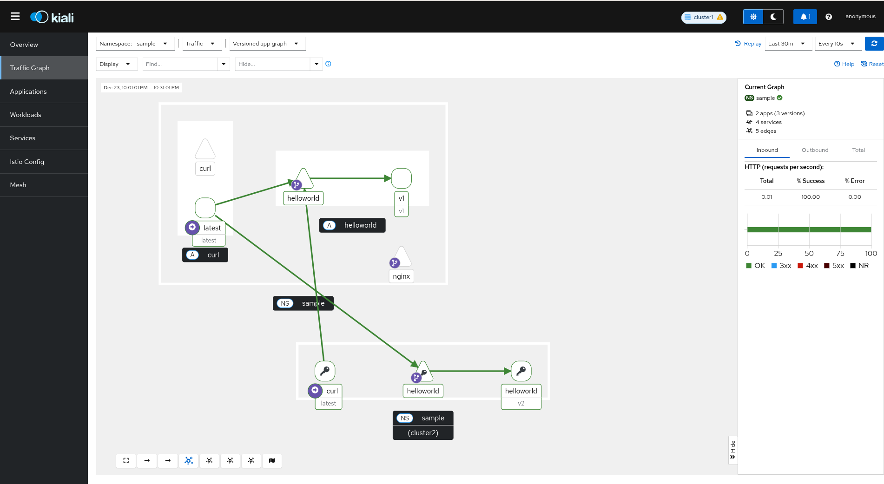

# Istio Multi-Cluster Setup with Kind

Local multi-cluster Istio service mesh using Kind clusters.

See [architecture.md](architecture.md) for diagrams and detailed explanation of how the mesh works.

## Prerequisites

- [Kind](https://kind.sigs.k8s.io/docs/user/quick-start/#installing-from-release-binaries), [kubectl](https://kubernetes.io/docs/tasks/tools/), [Task](https://taskfile.dev/), [istioctl](https://istio.io/latest/docs/setup/getting-started/#download), [Podman Desktop](https://podman-desktop.io/)

## Quick Start

```bash
task # see all available tasks
task setup # setup the kind clusters and Istio multi-cluster mesh
task verify-mesh # verify connectivity across clusters
task deploy-nginx # demo to show cross-cluster service access
task kiali-setup # install Prometheus and Kiali addons for Istio
task kiali-dashboard # open the Kiali dashboard
task clean # tear down the clusters and mesh
```

## Kiali Dashboard




## Relevant Links

- [Istio Multi-Cluster Documentation](https://istio.io/latest/docs/setup/install/multicluster/)
- [Istio Multi-Cluster Primary Remote](https://istio.io/latest/docs/setup/install/multicluster/primary-remote/)