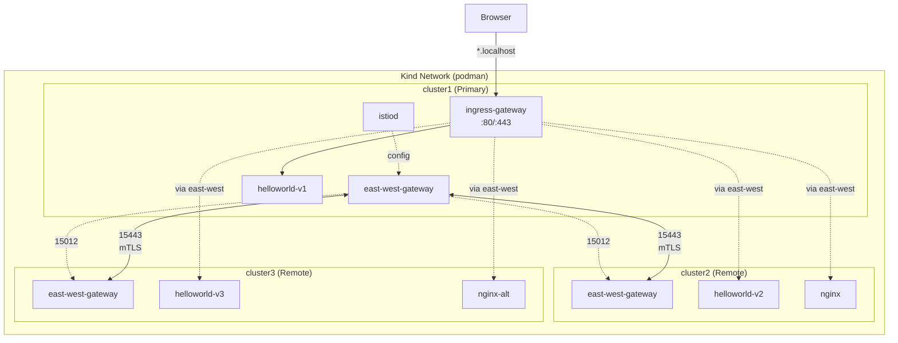
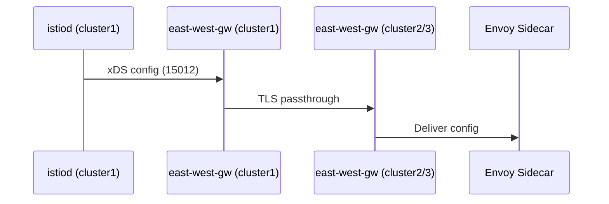
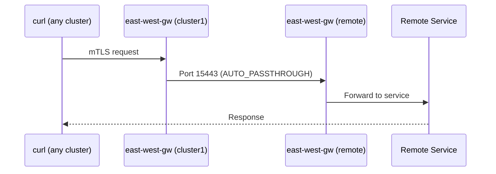
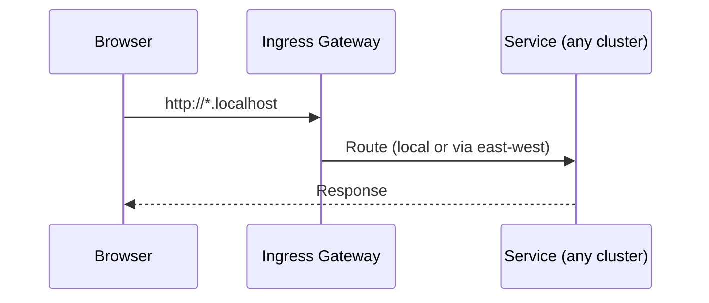

# Istio Multi-Cluster Mesh Architecture

## Overview

This POC demonstrates a **primary-remote** Istio multi-cluster topology using Kind clusters with different networks. One primary cluster (cluster1) hosts the control plane, while two remote clusters (cluster2, cluster3) connect to it.

## Traffic Flows

### Control Plane (cluster1 → remote clusters)

### Data Plane (cross-cluster request)

### Browser Access

## Key Components

| Component | Cluster | Purpose |
|-----------|---------|---------|
| **istiod** | cluster1 | Control plane for all clusters |
| **istio-ingressgateway** | cluster1 | Browser access (NodePort 30080/30443) |
| **istio-eastwestgateway** | all | Cross-network traffic + control plane |
| **MetalLB** | all | LoadBalancer IPs for gateways |

## Network Configuration

| Cluster | Network | Role | MetalLB Range |
|---------|---------|------|---------------|
| cluster1 | network1 | Primary | .200-.220 |
| cluster2 | network2 | Remote | .221-.240 |
| cluster3 | network3 | Remote | .241-.250 |

## Browser URLs

| URL | Destination |
|-----|-------------|
| `http://helloworld.localhost/hello` | Load balanced across v1, v2, v3 |
| `http://nginx.localhost` | cluster2 only |
| `http://nginx-alt.localhost` | cluster3 only |
